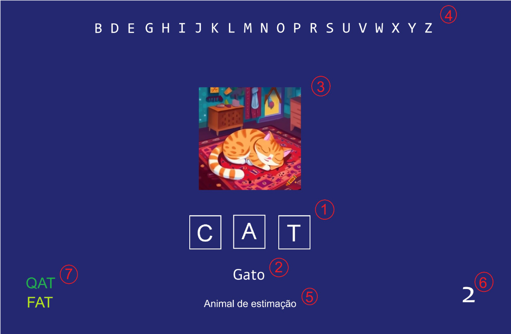

# **QAT: O jogo**

> Você sabe até onde vai seu vocabulário em inglês formando palavras de 3, 4 ou 5 letras? Desafie seus amigos e sejam os melhores! Comece a jogar agora e transforme seu inglês!

---


<h1 id="summary">Sumário</h1>

* **[1. Resumo do Documento de Design do Jogo](#resume)**

* **[2. História](#history)**
    * Personagens
    * Jogadores

* **[3. Configuração](#config)**
    * Características

* **[4. Narrativa](#narrative)**

* **[5. Jogabilidade](#gameplay)**
    * Evento principal
    * Mecânicas
    * Dinâmicas

* **[6. UI/Controles do Jogo](#ui)**

* **[7. Design de Níveis](#level)**

* **[8. Arte](#art)**
    * Visual
    * Áudio

* **[9. Plano de Desenvolvimento & Pilares de Design](#design)**
    * Protótipo
    * Equipe

* **[10. Fases do desenvolvimento](#dev)**
    * Cronograma
    * Milestones

* **[11. Compilar e executar](#compile)**


---

<h1 id="resume">Resumo do Documento de Design do Jogo</h1>

> Para melhores soluções, vamos nos concentrar em responder algumas perguntas sobre isso...

1. Como o jogo funciona?
   - O jogador forma palavras em inglês, utilizando todas as letras do alfabeto. As palavras têm três letras na Fase 1, quatro letras na Fase 2 e cico letras na Fase 3. O jogador pode trocar ou reorganizar letras para criar novas palavras.

2. Como o jogo se parece?<br/> 
   - O jogo apresenta uma interface minimalista. O tabuleiro de entrada das palavras está centralizado e organizado. Além disso, a tela apresenta os indicadores visuais das letras usadas e das letras restantes, uma lista das palavras geradas e a quantidadew de palavras válidas formadas pelo jogador.

3. Como o jogo será executado?<br/> 
   - O jogo será disponibilizado em plataformas digitais como dispositivos móveis (iOS e Android) e computadores. Será jogado utilizando o touchscreen ou teclado e mouse para digitar e interagir com as letras e os demais recursos do jogo.

4. Como o jogo será feito?<br/> 

---

<h1 id="history">História</h1>

> Já tentou lembrar de uma palavra que estava na ponta da língua? Quem nunca tentou mudar um letra de cada vez para encontrar a palavra certa? Agora você pode jogar e testar seus conhecimentos em inglês! Desafie seus amigos para ver quem consegue formar as palavras mais rápido!
> 
> QAT é um jogo educativo, projetado para despertar o interesse pela língua inglesa e auxiliar no aprendizado do vocabulário. O foco é exclusivamente na experiência de formar palavras e aprimorar o conhecimento do idioma.

## Personagens

## Jogadores

> O jogador, sua conta, perfil, ranking

- **Usuário**

> O jogador pode tentar jogar como um convidado. Ao final, se quiser entrar no ranking precisa fazer cadastro

- **Perfil**

> Cadastramento por db, mais tarde auth0(hotmail, facebook, gmail)

- **Social**
    - Ranking Geral
        > Um ranking para todos os jogadores de uma categoria
    - Ranking Local
        > Um ranking para um partida local entre jogadores convidados
    
---

<h1 id="config">Configuração</h1>


### Características

- **Gênero**
    > Puzzle, Casual
- **Plataforma**
    > PC, iOS, Android, Mobile
- **Público Alvo**
    > Estudantes entre fundamental e médio
- **Duração Estimada**
    > 15~30 minutos, para todas as fases
- **Requisitos Mínimos:**
    > Mouse e teclado; Touchscreen; **Pesquisar recursos de acessibilidade

---

<h1 id="narrative">Narrativa</h1>

- *Objetivo final*

> Formar palavras, a partir de "**qat**", trocando apenas uma letra por vez. Começando por 3 letras, depois 4 letras, até 5 letras. Seja o mais astuto e ágil de cada categoria.

- *Pitch de venda*

> Já tentou se lembrar de uma palavra que estava na ponta da língua? Quem nunca tentou mudar um letra de cada vez para encontrar a palavra certa? Agora você pode jogar e testar seus conhecimentos em inglês! Desafie seus amigos para ver quem consegue formar as palavras mais rápido! 

---

<h1 id="gameplay">Jogabilidade</h1>


### Loop Principal

O evento principal do jogo.

> **Acertar palavaras até completar todas letras do alfabeto. Primeiro com 3, depois 4, até 5**

Ao abrir o jogo, o jogador encontrará 3 linhas sublinhadas já preenchidas com as letras 'Q', 'A' e 'T'. O jogador poderá, então, modificar alguma dessas letras afim de formar uma nova palavra ou selecionar a randomização dessas 3 letras. A cada palavra formada gramaticamente correto, será apresentado o significado da palavra em sua forma literal ou colocada em uma determinada frase. Se essa nova palavra tiver uma letra não preenchida antes, ela contará como pontuação no alfabeto. E assim, seguindo até que o alfabeto seja completo. 

### Mecânicas

Regras e ações básicas.

  - O objetivo principal do jogo é completar todas as letras do alfabeto atráves de palavras em inglês com apenas 3 letras.
  - As ações permitidades ao jogador é: mudar uma das letras ou trocar a posição das letras.
  - Para completar o objetivo, o jogador terá que ter um conhecimento básico da lingua inglesa, e a partir disso, se desafiar para melhorar o seu vocabulario.

> **Trocar apenas uma letra por vez, ou inverter a palavra**

### Dinâmicas

O comportamento emergente que surge da jogabilidade, quando as mecânicas são colocadas em uso.

   - Os jogadores aprendem estratégias de formação de palavras, ao experimentarem diferntes combinações de letras;
   - A troca e reorganizaçõ de letras promovem o pensamento criativo e a resolução de problemas;
   - Os jogadores competem consigo mesmos e com outros players, para bater recordes anteriores de tempo, incentivando a repetição e o aprendizado constante.

> **A**

---

<h1 id="ui">UI/Controles do Jogo</h1>

### Comandos básicos

---

<h1 id="level">Design de Níveis</h1>

> Descrição sobre como deve ficar as cenas dentro do jogo

Ao decorrer que o jogador complete o desafio inicial com 3 letras, é disponiblizado um nível de dificuldade maior
que será completar o mesmo objetivo porém com palavras de 4 letras. Aumentando a complexidade de desafio.

### Cenário 1

 - 3 espaços sublinhados iniciando preenchidos pela palavra 'QAT'

### Cenário 2

- 4 espaços sublinhados vazios.

### Cenário 3

- 5 espaços sublinhados vazios.

---

<h1 id="art">Arte</h1>

> Descrições básicas, protótipos e ideias de arte

## Visual

### Avatar do Usuário

### Cenas

> Imagens de referência para cada cena, à adicionar na próxima etapa...


## Áudio

> Descrição básica de sonoplastia e trilha sonora

### Sonoplastia

### Trilha Sonora

---

<h1 id="design">Plano de Desenvolvimento & Pilares de Design</h1>

> Definir o sentido dos pilares, quais deles estão relacionados a quais áreas do desenvolvimento, e estrategicamente combinar a equipe com tarefas e funções

### Protótipo

> Projeto da Interface



"Primeiro prototipo do projeto"

### Equipe

> Definam suas aspirações e áreas de contribuição

- **Carlo** - **Tecnologia** 
    - **Desenvolvedor**
        - Tecnologia de Front-end
        - Auxiliar no desenvolvimento de design
        - Assistente de desenvolvedor de servidor
        - Focar em semiótica visual e experiência do usuário
        - Assistente de Direção e Produção (Documentação)
        

- **Vinícius** - **Design**
    - **Game designer**
        - Criar um design atraente, identidade e logotipo
        - Diretor de Design e Marketing 
  

- **Thiago** - **Psicologia**
    - **Desenvolvedor Estrutural**
        - Definir tecnologias de servidor e banco de dados
        

- **Victor** - **Pedagogia e Tecnologia**
    - **Produtor**
        - Feedback e melhorias contínuas
    -  **Desenvolvedor**
       -  Tecnologia de Back-end
       -  Desenvolver endpoints usados no Front-end
       -  Auxiliar na integração com o Front-end
        
---

<h1 id="dev">Fases do desenvolvimento</h1>

### Plano de Ação:

> Cronograma com milestones e seus respectivos entregáveis
> Recursos humanos: quem é responsável por fazer o quê (papel na equipe);
> Recursos tecnológicos: quais as tecnologias a serem usadas no desenvolvimento.


## Cronograma

- Data Inicial: 20/12
- Data Prazo Final: 20/01
- Planejamento: X dias ou até a data DD/MM/AAAA **(precisamos definir)**;
- Desenvolvimento do protótipo: X dias, Y semanas ou até a data DD/MM/AAAA **(precisamos definir)**;
- Testes e ajustes: X dias ou até a data DD/MM/AAAA **(precisamos definir)**;
- Finalização e lançamento: X dias, Y semanas ou até a data DD/MM/AAAA **(precisamos definir)**.

> 4 Semanas para entrega final e apresentação

## Milestones

> Fases de definição do projeto

### Projeto Protótipo / Primeiro protótipo funcional

- Discussão de funcionalidades básicas
- Discussão de servidor local
- Discussão de database 
- Discussão de design básico
- Discussão de carregamento de imagens

### Projeto Alpha / Fases de Testes

- Definição de funcionalidades básicas
- Definição de servidor local
- Definição de database 
- Definição de design básico
- Definição de carregamento de imagens


### Projeto Definitivo / Conclusão de implementações

- Implementação básica de todas fases
- Implementação básica de servidor na nuvem(vercel, github pages)
- Implementação de registro de usuários
- Implementação de design final
- Implementação de API/IA para recursos visuais

### Projeto Beta / Fases de Lançamento

- Teste e verificação de erros no cliente/servidor
- Implementação final de servidor e database
- Garantir segurança da database e usuários
- Garantir recursos de acessibilidade
- Gerenciamento de erros de custos computacionais das API/IA


---

<h1 id="compile">Compilar e executar</h1>

> Para compilar digite o seguinte comando
```
npm install
```

> Para executar o servidor
```
npm start
```

- E para abrir o jogo, basta acessar o home.html no seu navegador a partir do [localhost](https://localhost:3000), por enquanto...
- Bom jogo!

[Voltar ao topo](#summary)
